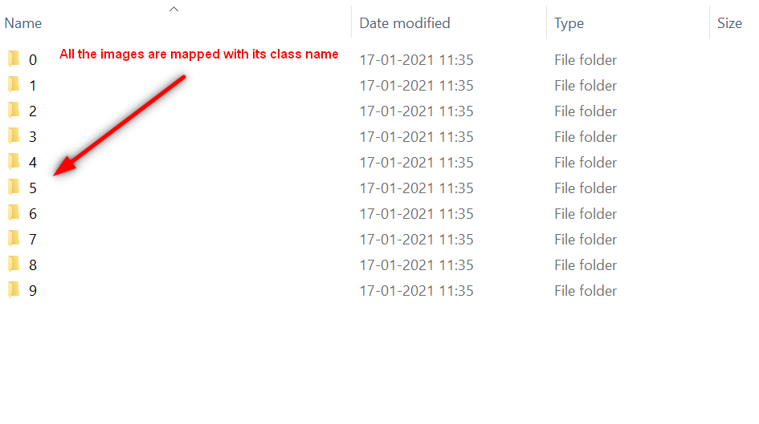
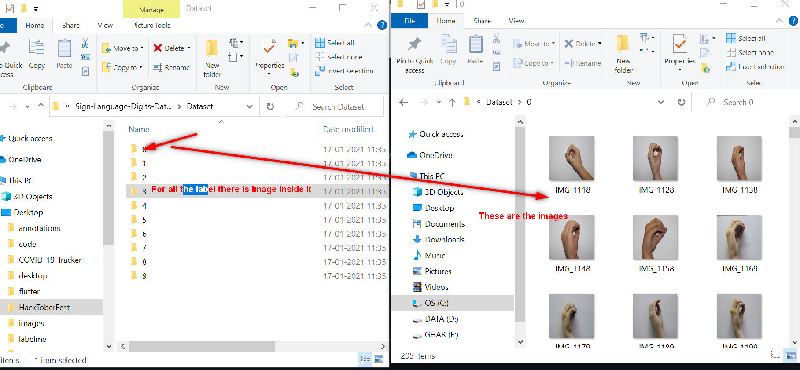
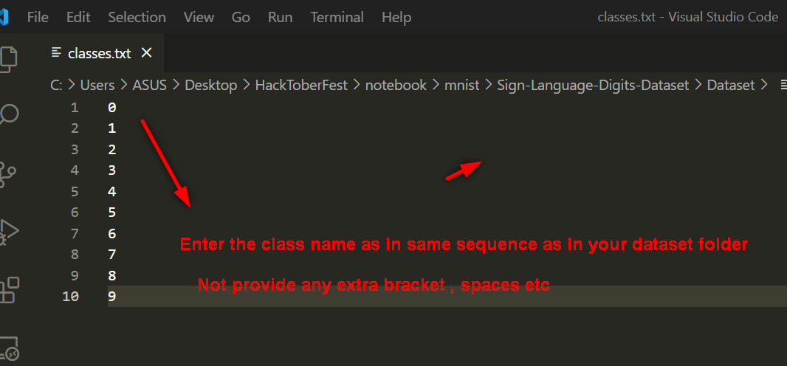
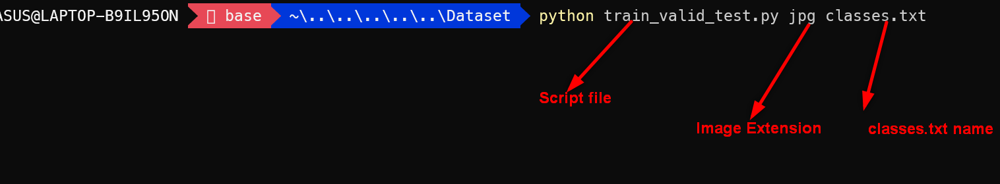
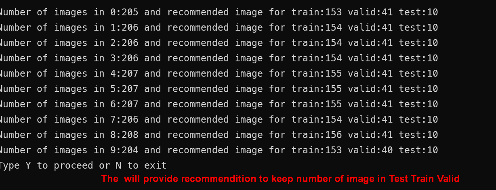
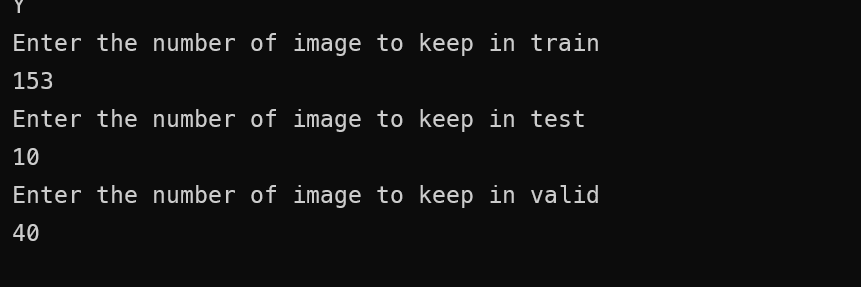
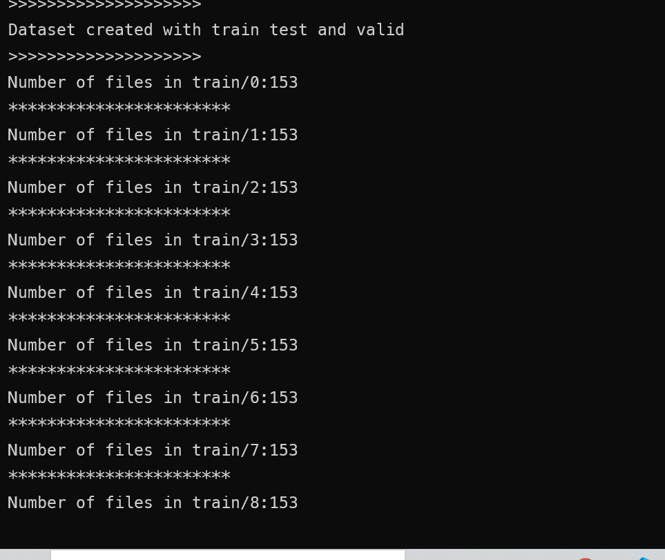
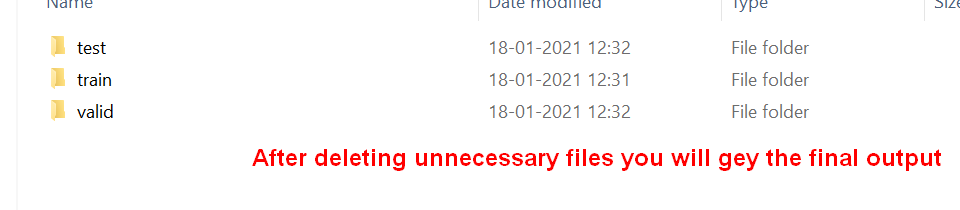

<h1 align="center">Welcome to Train Valid Test 👋</h1>
<p>
  
  <a href="#" target="_blank">
    
  </a>
</p>

> This script convert the image dataset classes to train test and valid folder for deep learning and computer vision task

## Install

```sh
pip install -r requirements.txt
```
## Follow these steps to get started:
- clone this script from github and put train_valid_test.py file and classes.txt file inside your dataset
















### The final output will look like


- You can also follow this [Video](https://screenrec.com/share/nQy6DFJHrz) tutorial, if you ignore my nervousness 🤣

## Author

👤 **Manikant Kumar**

* Website: https://devil-cyber.github.io/CodingSpace/
* Github: [@devi-cyber](https://github.com/devi-cyber)

## Show your support

Give a ⭐️ if this project helped you!

 